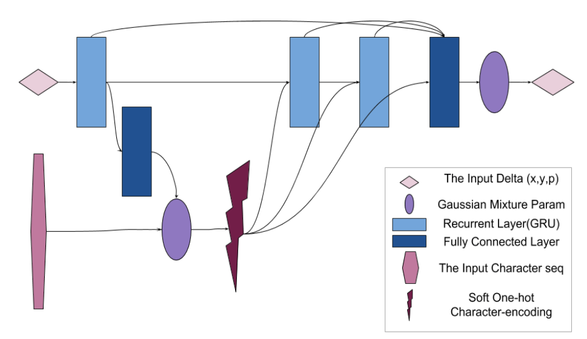
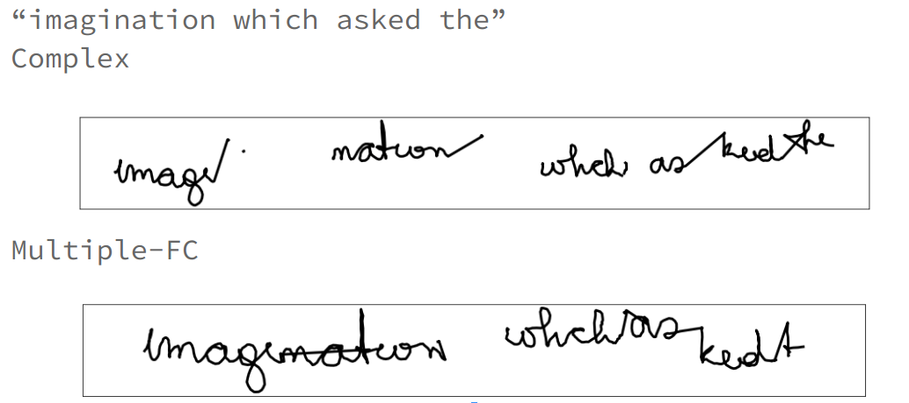
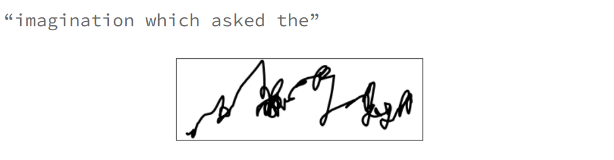

# The Graves-ey Font

A simple implementation of [Generating Sequences With Recurrent Neural Networks](https://arxiv.org/abs/1308.0850). We try to task of:

1) Unconditional Generation: Let the text generator just blabber random stuff. 

2) Conditional Generation: The text generator tries to write what you tell it to write.

3) Handwriting Recognition: Given a sequence of handwritting strokes, it predictes the charaters.

Experiment Docs: [Google Doc](https://docs.google.com/document/d/1HpNZtQtLDDAM9jQ106UIA4NGUZ2Xedkjni9cu1K8n6U/edit?usp=sharing)

Experiment Slides: [Google Slides](https://docs.google.com/presentation/d/1uS5VWx0Xw61nqVMkHyiOVLBMG1RDt8f02TQLJpUGKuM/edit?usp=sharing)

## Training Details:

* 3 Variants of Architecture tried:

  *  Single GRU(900)-Linear(122)
  
  *  GRU(256)-GRU(512)-Linear(256)-Linear(122)
  
  *  GRU(400)-GRU(400)-GRU(400)-Linear(122)

* Details: 
  
  * All predict parameters of a Mixture of 20 Gaussians
  
  * (2) and (3) have skip connections as in paper. 

  * (1) Trained with no weight balancing for pen lift.

  * ADAM Optimizer

  * 5500 Training Sequences, 250 Test Sequences (Graves etal. use ~ 10K sequences for training)

## 1: Unconditional Generation:

### Our Results:

On validation set:

On Self-Generation:

From Paper:

## 2: Conditional Generation

For conditional Generation, we modify the paper architecture slightly to the one below, for enabling parallel forward pass of all time steps.

Cherry picking from the val set, we get:

But change the text, and you still get the same output.

So, conditioning is not learnt in this way. Self-generation is even more gibberish:

#### Next steps:

1) Model matching paper architecture in training.
2) Try a simple gaussian over the sequence of encoding based on the cur time step, instead of the long route the paper takes to see if it is useful.
2) What if we pretrain the conditional gaussians to first get the soft encoding similar to ground truth encoding based on the location of the gaussians?

